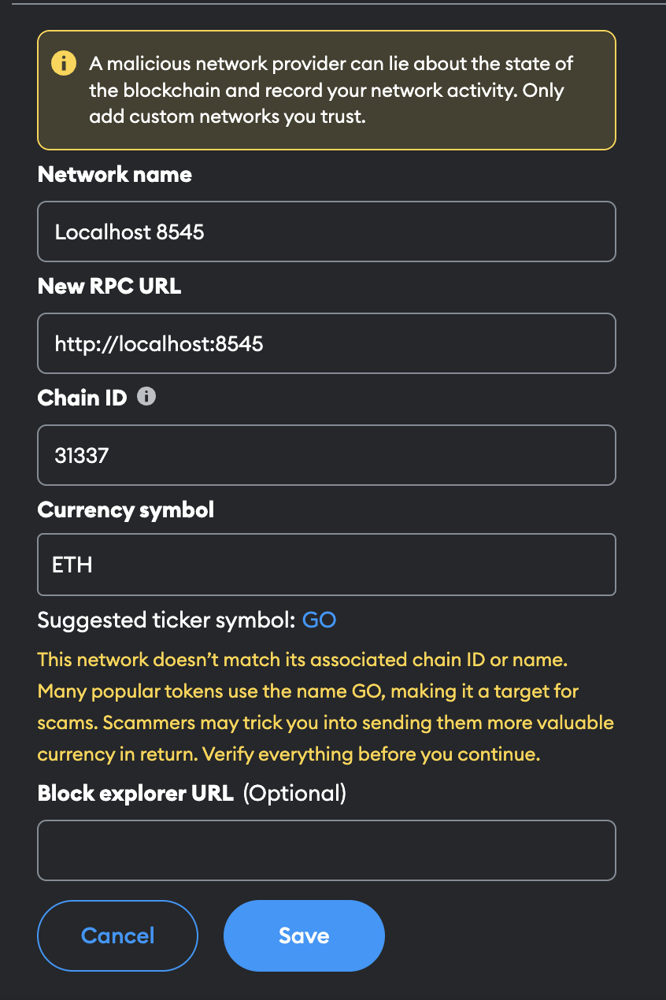

# DeGames App

## Getting Started 


1. Install the dependencies 
```
yarn install 
cd ./app 
yarn install
```

2. Compile smart contracts
```
yarn compile
```

3. Start the local hardhat network
```
yarn start-node
```

4. Deploy your contracts on local network
```
yarn deploy
```

5. Start the front-end app
```
cd ./app 
yarn dev
```

## How to connect your wallet to the local network?

### With metamask

Go to `Add Network` > `Add network manually` and input the following form:



You can have more info [here](https://docs.metamask.io/wallet/how-to/get-started-building/run-devnet/).

## How to deploy the smart contracts to a real network? 

TODO 